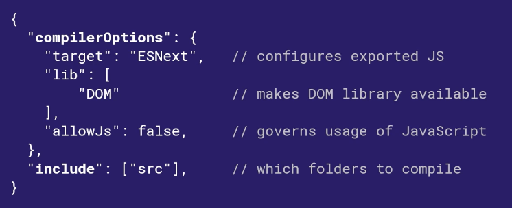
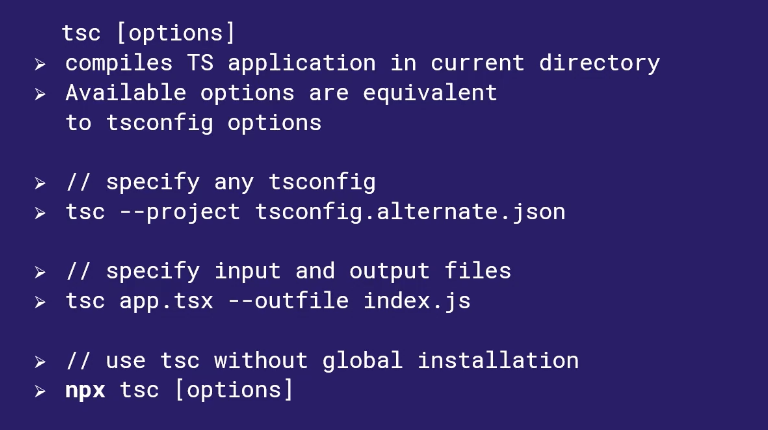

# Configuring and Compiling TypeScript 5 Projects
## Typescript Compilation
- Importing for web applications, although there are other languages that may work faster (Java and C#)

## Typescript TSConfig
- Governs all the options/configuration settings affecting a TypeScript project
- Placing a TSConfig file in a directory indicates a TypeScript project
- Over 100 options configured via JSON
- Example File:
	

## TypeScript Compiler (TSC)
- Underlies almost all processes which turn TypeScript into Javascript
- Command Line tool that is installed via Node

## Example Use:
- npm install
- npm run dev

## Compiling TypeScript 5 Applications
- Patterns of Non-Trivial Typescript Application Compilation
- Many-to-One Files
- View Engine

## Using the Typescript Compiler Examples

## Watching for Changes
- watch → compiles TS to JS automatically whenever a change is made
	- Helps focus on building rather than compiling code
- Typescript compiler (tsc) is installed via npm

## Configuring Application and Structure: Goals
- Understanding Application Structure
- Source Directory: Developer-authored Typescript files are located
- Output Directory: JS generated by Typescript located
- Declaration Directory: Declaration Files

## Out-File or Out-Directory
- Outputting one file is simple creates a single JS file browsers can load
- Outputting multiple files to a directory is flexible: package the JS files into however you want

## TypeScript Configuration Affection App Structure
- declarationDir: Specify a directory in which declaration files are output
- noEmit: Don’t generate any files at all
- outDir: Specify which directory code should be output to
- outFile: Specify path to a single file which the entire app should be compiled to
- rootDir: Specify a path (or a URL) where source files are found (overriding default of src)

## Watch Files
- tsc_watchfile (file watching): Override file watching algorithm
- tsc_watchdirectory (directory watching): Override directory watching algorithm
- .tsconfig (fallback to TSConfig): Uses TSConfig is no environment variable

## Configuration Bases
- Default values for a Typescript project, providing overridable values for certain settings
	- Often chosen by coding professional

## TypeScript Configurations Governing Javascript
- allowJS: Javascript can’t be imported unless this is enabled. Other options have no affect w/out allowJS
- checkJS: Governs whether or not types should be inferred from JS files
- maxNOdeModuleDepth: For checkJS, limits type inferences for node dependencies

## checkJS Type Inferring
- Automatic type inference based on default values
	- But, using declaration (d.ts) files is a sophisticated way of handling JS typing

## Advantages and Disadvantages of Supporting Javascript in a TypeScript project
- Advantages:
	- Access to wide variety of tools and libraries not written in TS
	- Fast Prototyping
	- Developers who don’t use Typescript can still contribute
- Disadvantages
	- Tools that don’t support TS are likely either old or hastily written
	- Prototypes written in JS still need to be converted to TS
	- Developing modules in Javascript may increase technical debt

## Configuring Type Checking
- Sets apart TypeScript from JavaScript → Clarity, Security, and COllaboration
- Preventing Typescript specific errors and bad software engineering practices

## Examples of Type Checking Errors
- noFallthroughCasesInSwitch: Forces inclusion of break statement
- allowUnreachableCode: Writing code that would never be executed?
- noImplicitAny: Not possible to infer an arguments’ type automatically
- noImplicitOverride: overriding another similar named function

## Comparing Strict and Non-Strict Type Checking
- Strict:
	- Longer initial development – developer must consider every warning
	- High barrier to entry
	- Higher quality of finished code
	- Certain errors will no longer be possible within the app
- Laissez-Faire
	- Faster initial development
	- Low barrier to entry, quality of finished code, Vigilance 

## Project References
- For incremental build, all-in-one build, and customer facing
- Allow a monolithic TypeScript project to be broken up into smaller parcels
- Referenced modules must be composite projects

## Composite Applications – Workflow
- Create tsconfig file with composite setting enabled for project that will be imported
- Import files from the composite project into the main project as usual
- Use the –build flag when compiling with tsc to check and recompile composite projects as necessary
- Process
	- Child tsconfig.json: Composite: true and declaration false
	- Parent: references, paths: link to child .json file
	- Import it into the file using path to link of child .ts file
	- tsc --build --verbose: Tells about the different projects being considered for a build
